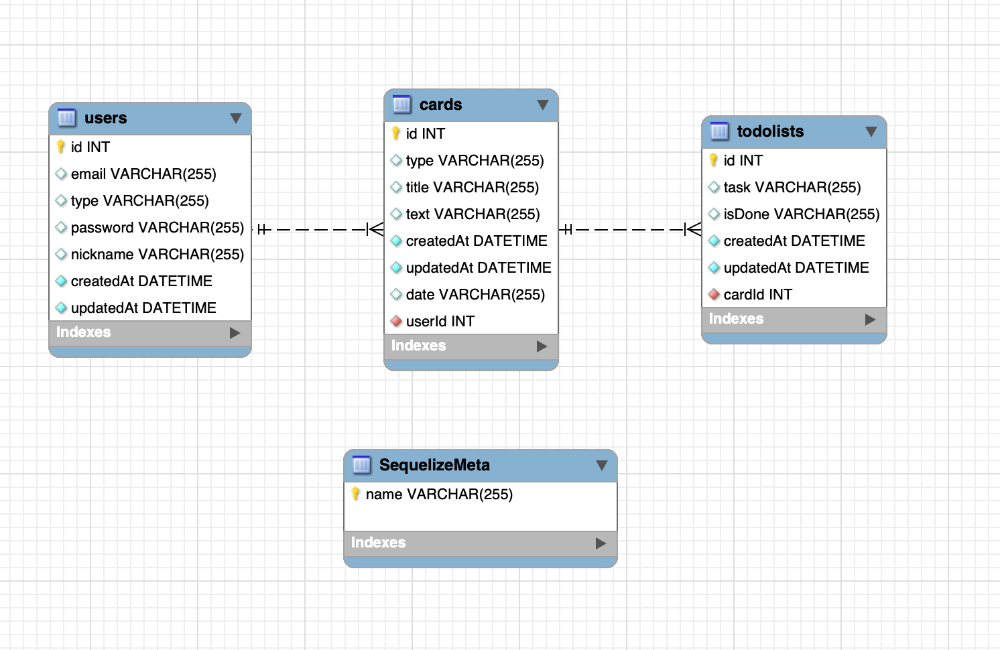

</img> 

# **Todaying**

팀명 : dayfly
프로젝트명 : Todaying
=============

# **Development Stack:컴퓨터: :렌치: :망치:  **

>

>

---------------------------------------
# **Workflow**

**Client-Side(React Components)** 
</img> 

**Server-Side(Data Schema)** 
</img> 
